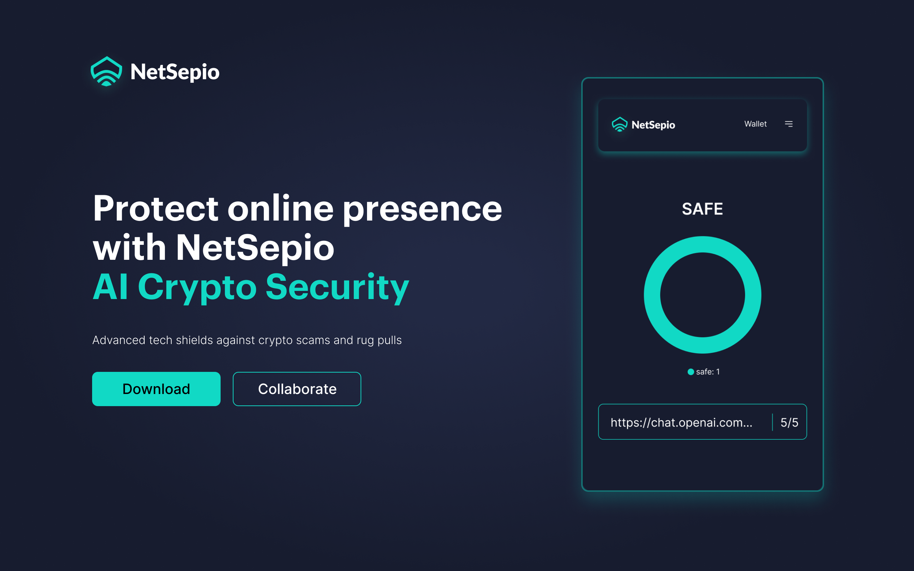

#Netsepio

<p align="center">
  
</p>

## Table of Contents

1. [Introduction](#introduction)
2. [Features](#features)
3. [Installation](#installation)
   - [Using npm](#using-npm)
   - [Using Yarn](#using-yarn)
   - [Using Pnpm](#using-pnpm)
4. [Configuration](#configuration)
5. [Usage](#usage)
   - [Data Collection and Privacy](#data-collection-and-privacy)
   - [Building Your Own Extension](#building-your-own-extension)
   - [Calling Functions](#calling-functions)
6. [Examples](#examples)
7. [Documentation](#documentation)
8. [Contributing](#contributing)
9. [License](#license)
10. [Acknowledgments](#acknowledgments)

# Introduction

[NetSepio](https://netsepio.com/) is a crypto wallet that can be used to manage digital assets and post review for a particular domain on the Aptos blockchain. You can download the extension directly from the chrome web store and use it .

# Features

Unlock a world of possibilities with our crypto wallet extension designed to streamline your digital asset management on the Ethereum blockchain. Download the extension directly from the Chrome Web Store to experience the following features:

- **Domain Reviews:** Post reviews for any domain effortlessly, providing valuable insights on the Ethereum blockchain.

- **Aptos-Based Wallet Creation:** Seamlessly create a secure Aptos-based wallet, ensuring the safety and accessibility of your digital assets.

- **Token Transactions:** Effortlessly send tokens to streamline your cryptocurrency transactions and enhance your overall digital asset management experience.

Download now and elevate your crypto experience with a powerful and user-friendly extension.

## Installation

You can Install the extention from the chrome webstore. You can find it in our [website](https://netsepio.com/)

## Getting started

To get started, clone the repository and install the dependencies:

git clone [https://github.com/NetSepio/ChromiumExtension.git](https://github.com/NetSepio/ChromiumExtension.git)

### Using npm

```

cd ChromiumExtension
npm install

```

### Using yarn

```

cd ChromiumExtension
yarn install

```

### Using pnpm

```

cd ChromiumExtension
pnpm install

```

## Running the app

To run the app locally, use the following command:

### Using npm

```
npm run dev
```

### Using yarn

```
yarn run dev
```

### Using pnpm

```
pnpm run dev
```

This will start a development server at `http://localhost:3000`.

## Building the app

To build the app for production, use the following command:

### Using npm

```

npm run build

```

### Using yarn

```

yarn run build

```

### Using pnpm

```

pnpm run build

```

This will generate a production build in the `build` directory.

## Configuration

Before running the project, make sure to set the following configuration variables in your environment:

NB: you can get the api key for NFT Storage from [NFTStorage](https://nft.storage/manage/)

```bash
export PUBLIC_GATEWAY_URL="https://gateway.netsepio.com/api/v1.0"
export PUBLIC_SUBGRAPH_URL="https://api.thegraph.com/subgraphs/name/netsepio/netsepio-mumbai"
export PUBLIC_NFT_STORAGE_API_KEY="your-api-key-here"
export PUBLIC_NODE_URL="https://fullnode.testnet.aptoslabs.com/v1"

```

## Data Collection and Privacy

### Overview

Our extension collects data from websites visited by users to provide insights into the safety, presence of harmful content, ad frequency, and potential malware. This data is anonymized and aggregated to offer valuable information to the community.

### User Reviews

#### Website Safety Ratings

- **Safe:** No known issues, safe for browsing.
- **Caution:** Some potential risks or concerns.
- **Harmful:** Identified as potentially harmful or unsafe.
- **Ad Frequency:** Rate your experience with ad frequency (low, moderate, high).

#### Privacy and Anonymity

We prioritize user privacy and ensure that collected data is anonymized and aggregated. Personal information is not shared or stored in our databases.

### How to Review a Website

1. Install the extension.
2. Browse to a website you want to review.
3. Click on the extension icon.
4. Choose the appropriate safety rating and provide additional comments if desired.
5. Submit your review.

### How Data Is Used

The data collected is used to generate safety ratings and insights for the community. It helps users make informed decisions about the websites they visit.

### Opting Out

Users have the option to opt-out of data collection. Visit the extension settings to manage your preferences.

**Note:** Be transparent and clear about your data collection practices. Ensure compliance with privacy laws and regulations, and consider providing a more detailed privacy policy in a separate document.

# Building the Extension

## Manifest File (`manifest.json`)

The `manifest.json` file is a crucial part of building a browser extension. It provides metadata about the extension to the browser. Below is an example structure for your `manifest.json` file. Adjust the details according to your specific requirements:

```json
{
	"name": "Your Extension Name",
	"version": "1.0.0",
	"manifest_version": 3,
	"description": "Description of your extension.",
	"icons": {
		"48": "icon.png",
		"128": "icon-128.png"
	},
	"browser_action": {
		"default_icon": "icon.png",
		"default_popup": "popup.html",
		"default_title": "Click to open the extension"
	},
	"permissions": [
		"storage",
		"activeTab",
		"webNavigation",
		"webRequest",
		"webRequestBlocking"
		// Add any additional permissions your extension needs
	],
	"content_scripts": [
		{
			"matches": ["<all_urls>"],
			"js": ["content.js"]
		}
		// Add content scripts if needed
	],
	"background": {
		"scripts": ["background.js"],
		"persistent": false
	},
	"web_accessible_resources": ["main.css", "images/"],
	"icons": {
		"48": "images/icon-48.png",
		"128": "images/icon-128.png"
		// Add more icon sizes if necessary
	},
	"content_security_policy": {
		"extension_pages": "script-src 'self'; object-src 'self';"
	},
	"browser_specific_settings": {
		"gecko": {
			"id": "your_extension_id@example.com" // If targeting Firefox
		}
	},
	"author": "Your Name",
	"homepage_url": "https://your-extension-homepage.com",
	"short_name": "Your Extension"
}
```

Replace placeholders such as "Your Extension Name", "Description of your extension", and others with your actual details.

"browser_action": This section defines the extension's browser action, which typically includes an icon and a popup HTML page.
"permissions": Specify the permissions your extension needs, such as access to storage, tabs, and web requests.
"content_scripts": If your extension injects scripts into web pages, define them here.
"background": If your extension has background scripts, define them here.
"web_accessible_resources": List resources that should be accessible to web pages.
"content_security_policy": Configure the content security policy.
"browser_specific_settings": If your extension targets a specific browser, such as Firefox, provide browser-specific settings.

Refer to the official [documentation](https://developer.chrome.com/docs/extensions/mv3/getstarted/) for more details on the manifest.json file and its options.

## Calling Functions

### 1. Generate Wallet

To generate a wallet, use the `generateWallet` function. This function creates a wallet, including a mnemonic phrase, private key, public key, and wallet address. The private and public keys are stored in a Svelte store and saved to local storage.

```typescript
// Code in src/routes/get-secret-key/+page.svelte

import { AptosAccount } from 'aptos';

// The derivation path for the wallet
const path = `m/44'/637'/0'/0'/0'`;

// Store to hold mnemonic, private key, public key, and wallet address
let mnemonic = '';
let address = '';

// Function to generate a wallet
const generateWallet = async () => {
	// Generate a 12-word mnemonic phrase
	mnemonic = bip39.generateMnemonic(wordlist, 128);

	// Derive a key pair from the mnemonic and path
	let keypair = AptosAccount.fromDerivePath(path, mnemonic);

	// Convert the key pair to a private key object
	let account = keypair.toPrivateKeyObject();

	// Extract the address, private key, and public key
	address = account.address;
	let privKey = account.privateKeyHex.slice(2);
	let pubKey = account.publicKeyHex;

	// Set the private and public keys in the Svelte store
	privateKey.set(privKey);
	publicKey.set(pubKey);

	// Set the wallet address in the Svelte store
	walletAddress.set(address);
	// Set the mnemonic phrase in the Svelte store
	mnemonicPhrase.set(mnemonic);
};
```

### 2. Create Password and Authenticate

To create a password and initiate the authentication flow, you can use the following Svelte code. This involves obtaining a flow ID, signing a message with the private key, and sending the signature to authenticate the user.

```typescript
// Code in src/routes/get-secret-key/create-password/+page.svelte

// Function to handle form submission and initiate authentication
async function fetchData() {
	try {
		// Sign the message with the private key
		const signData = await signWithKey(data.payload);

		// Send the signature to authenticate the user
		loginResponse = await sendSignature(
			data.payload.flowId,
			signData?.signature as string,
			signData?.pubKey as string
		);

		// Encrypt and store the user's password
		await encryptAndStorePassword(newPassword);

		// Set the JWT token in the Svelte store
		jwtToken.set(loginResponse.payload.token);

		// Show a modal indicating successful authentication
		showModal = true;
	} catch (err) {
		error = `Something went wrong`;
		console.error(error);
	}
}

// Function to obtain a flow ID for authentication
const askFlowId = async () => {
	let address: string = '';

	// Retrieve the wallet address from the Svelte store
	walletAddress.subscribe((u) => (address = u));

	// Fetch the flow ID from the public gateway
	const data = await fetch(`${PUBLIC_GATEWAY_URL}/flowid?walletAddress=${address}`);

	return data.json();
};

// Function to sign a message with the private key
const signWithKey = async (message: messageType) => {
	// Implementation details...
	// Example: signing a message using AptosAccount
};

// Function to send the signature for authentication
const sendSignature = async (flowId: string, signature: string, publicKey: string) => {
	// Implementation details...
	// Example: sending the signature to authenticate the user
};
```

Ensure that you replace placeholders like PUBLIC_GATEWAY_URL with the actual values from your application. This setup allows users to create an account, generate a wallet, and initiate the authentication process.

## License

This project is licensed under the MIT License - see the [LICENSE](LICENSE) file for details.

## Acknowledgments

This project was built using [Svelte Kit](https://kit.svelte.dev/) and [TypeScript](https://www.typescriptlang.org/). Special thanks to the creators and maintainers of these tools.

## Our Team

<div>
    
    <a href="https://github.com/Shachindra">Shachindra</a>
</div>
<br/>
<div>
    
    <a href="https://github.com/iswarmondal" >Iswar</a>
</div>
<br/>
<div>
    
    <a href="https://github.com/adimis-ai" >Aditya</a>
</div>
```
