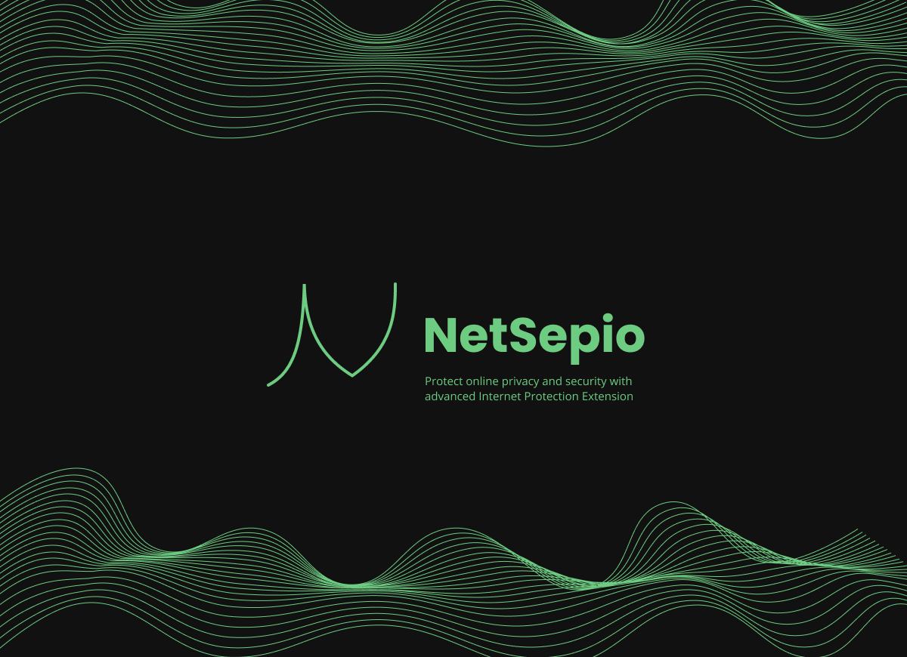

<p align="center">
  
</p>
# Introduction

NetSepio is a crypto wallet that can be used to manage digital assets and post review for a particular domain on the Ethereum blockchain. You can download the extension directly from the chrome web store and use it .

# Features

- Review for any domain
- Send Tokens
- Cross platform

## Getting started

To get started, clone the repository and install the dependencies:

git clone [github](https://github.com/NetSepio/ChromiumExtension.git)

cd netsepio-chrome-extension
npm install

## Running the app

To run the app locally, use the following command:

```
npm run dev
```

This will start a development server at `http://localhost:3000`.

## Building the app

To build the app for production, use the following command:

```
npm run build
```

This will generate a production build in the `build` directory.

## License

This project is licensed under the MIT License - see the [LICENSE](LICENSE) file for details.

## Acknowledgments

This project was built using [Svelte Kit](https://kit.svelte.dev/) and [TypeScript](https://www.typescriptlang.org/). Special thanks to the creators and maintainers of these tools.

## Our Team

<div>
    
    <a href="https://github.com/Shachindra">Shachindra</a>
</div>
<br/>
<div>
    
    <a href="https://github.com/iswarmondal" >Iswar</a>
</div>
<br/>
<div>
    
    <a href="https://github.com/adimis-ai" >Aditya</a>
</div>
